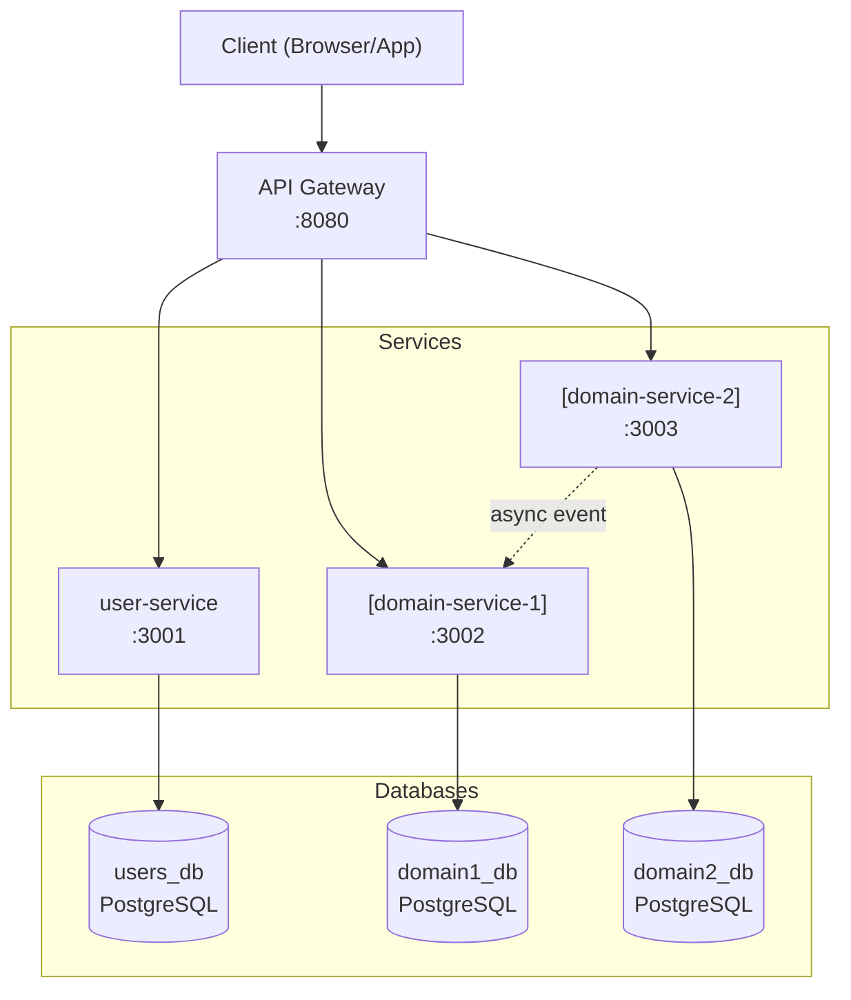
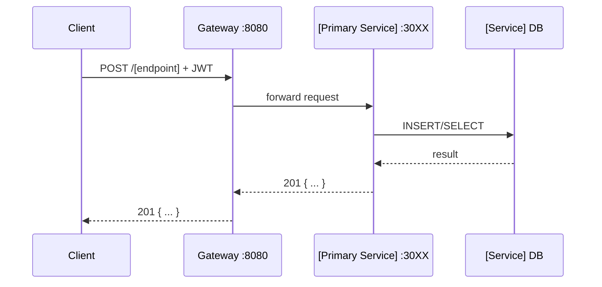

# /start-discovery — Project Discovery Chain

Run this command to define a new mock project from scratch. It leads you through 8 questions from the Day-08 Discovery Chain, generates your DOP, IRDs, sprint plan, architecture, and CLAUDE.md — all ready to push to Notion and commit.

**Trigger phrases:** "start discovery", "new project", "define project", "/start-discovery", `!start-discovery`

---

## Pre-Flight

Before asking Q1, execute these steps silently:

1. Read hub CLAUDE.md to load identity, rules, and memory sync protocol
2. Read `memory/skills-ledger.md` — the new project will inherit these patterns
3. Determine the next DOP number:
   - Search `docs/` in the current working directory for existing `DOP-*.md` files
   - If none exist, start at `DOP-001`
   - If `DOP-001` exists, use `DOP-002`, etc.
4. Print the opening header:

```
╔══════════════════════════════════════════════════════════════╗
║         PROJECT DISCOVERY CHAIN — ProOps2026                ║
║         8 Questions → DOP + IRDs + Sprint + Architecture     ║
╚══════════════════════════════════════════════════════════════╝

This session will generate a fully defined project structure.
Work through the questions in order. Each answer removes a gap
that will cost you during implementation.

Rules:
  • Questions build on each other — do not skip
  • For every question: Option A = your answer | Option B = AI suggestion
  • Brainstorm FIRST. Write documents SECOND.
  • After Q8, you confirm before any files are written.

Ready? Let's start.
──────────────────────────────────────────────────────────────
```

---

## The 8-Question Discovery Chain

Run each question one by one. Do NOT present all 8 at once. Wait for the user's response before moving to the next question.

For every question, print this format:

```
┌─ Q[N] of 8 — [Question Title] ──────────────────────────────┐
│                                                              │
│  [Full question text]                                        │
│                                                              │
│  Option A: Type your answer                                  │
│  Option B: Type "suggest" — I'll generate a best practice   │
│            recommendation for your project type             │
└──────────────────────────────────────────────────────────────┘
```

If the user types "suggest" (Option B), generate the best practice answer based on:
- The project type named so far (if known)
- Industry standards for that domain
- The patterns in `memory/skills-ledger.md`
Then ask: "Does this work, or do you want to modify it?"

---

### Q1 — Problem Statement + Users

**Question:**
> What problem does your application solve — and who has this problem?
> Write it in two sentences before asking me anything.
>
> Format: "[User type] struggle with [specific pain]. Our system solves this by [mechanism]."
> Then list your user types (e.g., Guest, Admin, Staff).

**Option B — Best Practice Suggestion Logic:**
Ask first: "What type of project is this? (e.g., E-commerce, Hotel Booking, Food Delivery, Task Manager, Game Server, Banking)"

Then generate based on project type:

| Project Type | Suggested Problem Statement | User Types |
|---|---|---|
| E-commerce | "Online shoppers struggle to find, compare, and purchase products from multiple vendors in one place. Our system provides a unified catalog, cart, and checkout experience." | Guest, Customer, Admin |
| Hotel Booking | "Travelers struggle to find available rooms, compare prices, and confirm bookings without double-booking errors. Our system provides real-time availability, booking management, and payment processing." | Guest, Registered Guest, Hotel Staff, Admin |
| Food Delivery | "Customers struggle to order food from local restaurants and track delivery in real time. Our system connects customers, restaurants, and delivery drivers on a single platform." | Customer, Restaurant Owner, Delivery Driver, Admin |
| Task Manager | "Teams struggle to assign, track, and prioritize work across multiple projects without losing context. Our system provides task boards, assignments, and progress tracking." | Team Member, Project Manager, Admin |
| Game Server | "Multiplayer game players need persistent character state, real-time matchmaking, and anti-cheat protection. Our system manages player accounts, game sessions, and leaderboards." | Player, Game Admin, Spectator |
| Banking | "Retail customers struggle to manage accounts, transfers, and loans securely across devices. Our system provides secure account management with audit trails and fraud detection." | Customer, Bank Teller, Admin, Auditor |

**Validation after answer:**
Check:
- Is the problem statement two sentences minimum?
- Does it name a specific user type, a specific pain, and a specific solution mechanism?
- Are there at least 2 distinct user types?

If gaps: "I see a gap — [specific issue]. Can you clarify: [specific question]?"

**Save:** `answers.problem_statement`, `answers.user_types`

---

### Q2 — Services + Ownership

**Question:**
> What are the core user actions — and which service owns each one?
>
> List your services and for each service state:
>   1. What it OWNS (data, operations)
>   2. What it does NOT own (explicit boundary)
>
> Example: "user-service — owns: authentication, user profiles | does NOT own: orders, products"

**Option B — Best Practice Suggestion Logic:**
Generate based on project type and user types from Q1:

| Project Type | Recommended Services |
|---|---|
| E-commerce | `user-service` (auth, profiles) · `product-service` (catalog, inventory) · `order-service` (cart, checkout, order history) |
| Hotel Booking | `user-service` (auth, guest profiles) · `room-service` (rooms, availability, pricing) · `booking-service` (reservations, payments, cancellations) |
| Food Delivery | `user-service` (auth, addresses) · `restaurant-service` (menus, restaurants) · `order-service` (orders, delivery tracking, payments) |
| Task Manager | `user-service` (auth, teams) · `project-service` (projects, boards) · `task-service` (tasks, assignments, comments) |
| Game Server | `auth-service` (accounts, sessions, JWT) · `character-service` (characters, inventory, stats) · `game-service` (sessions, matchmaking, leaderboards) |
| Banking | `auth-service` (login, MFA, sessions) · `account-service` (accounts, balances) · `transaction-service` (transfers, history, fraud detection) |

Apply standard rules:
- Each service gets its own database — no shared tables
- Cross-service references: store UUID only, never a foreign key
- Suggested port assignment: user/auth: 3001, domain service 1: 3002, domain service 2: 3003, gateway: 8080

**Validation after answer:**
- Does any service own more than one major responsibility? → suggest splitting
- Is there any user action with no clear service owner? → flag the gap
- Do any two services share ownership of the same data? → flag the conflict

**Save:** `answers.services[]` (name, port, owns, does_not_own)

---

### Q3 — CRUD Flow Traces

**Question:**
> For each core user action, trace the full flow end to end.
>
> For each of your 3–5 most important actions, answer:
>   1. HTTP method + endpoint
>   2. Which service handles it
>   3. Database operation (INSERT / SELECT / UPDATE / DELETE)
>   4. What is returned (HTTP status + JSON shape)
>   5. Does another service need to be notified? (sync HTTP call or async event?)

**Option B — Best Practice Suggestion Logic:**
Generate the 3 most critical flows for the project type:

For E-commerce:
```
Flow 1 — Customer places an order
  POST /orders → order-service
  INSERT into orders table
  Returns 201 { "orderId": "uuid", "status": "pending" }
  → Notifies product-service (async) to decrement inventory

Flow 2 — Customer browses products
  GET /products?category=X → product-service
  SELECT from products WHERE category = X
  Returns 200 { "items": [...] }
  → No cross-service calls

Flow 3 — Customer registers
  POST /users/register → user-service
  INSERT into users table, hash password
  Returns 201 { "userId": "uuid", "token": "jwt" }
  → No cross-service calls
```

Adapt for each project type. Always include: register/login flow, the primary business action (book/order/create task), and a read/list flow.

**Validation after answer:**
- Every service mentioned in Q2 must appear in at least one flow
- Every flow must have a defined HTTP status code and JSON response shape
- Flag: "Service X appears in Q2 but has no flow in Q3 — what does it do?"

**Save:** `answers.flows[]` (action, method, endpoint, service, db_op, response, notifications)

---

### Q4 — Data Model

**Question:**
> Design the data model for each service.
>
> For each service, define:
>   1. Table name(s) it owns
>   2. Columns with data types and constraints (NOT NULL, UNIQUE, DEFAULT)
>   3. Primary key (always UUID)
>   4. How cross-service references work (store the UUID, no foreign keys across services)
>   5. What indexes you need for the queries in Q3

**Option B — Best Practice Suggestion Logic:**
Generate SQL CREATE TABLE statements for each service:

For E-commerce example:
```sql
-- user-service
CREATE TABLE users (
  id          UUID PRIMARY KEY DEFAULT gen_random_uuid(),
  email       VARCHAR(255) NOT NULL UNIQUE,
  password_hash VARCHAR(255) NOT NULL,
  name        VARCHAR(255) NOT NULL,
  created_at  TIMESTAMPTZ NOT NULL DEFAULT NOW(),
  updated_at  TIMESTAMPTZ NOT NULL DEFAULT NOW()
);
CREATE INDEX idx_users_email ON users(email);

-- product-service
CREATE TABLE products (
  id          UUID PRIMARY KEY DEFAULT gen_random_uuid(),
  name        VARCHAR(255) NOT NULL,
  description TEXT,
  price       NUMERIC(10,2) NOT NULL CHECK (price >= 0),
  stock       INTEGER NOT NULL DEFAULT 0 CHECK (stock >= 0),
  category    VARCHAR(100),
  created_at  TIMESTAMPTZ NOT NULL DEFAULT NOW()
);

-- order-service (cross-service: stores user_id UUID, no FK)
CREATE TABLE orders (
  id          UUID PRIMARY KEY DEFAULT gen_random_uuid(),
  user_id     UUID NOT NULL,           -- ref to user-service, NO FK
  status      VARCHAR(50) NOT NULL DEFAULT 'pending',
  total       NUMERIC(10,2) NOT NULL,
  created_at  TIMESTAMPTZ NOT NULL DEFAULT NOW()
);
CREATE TABLE order_items (
  id          UUID PRIMARY KEY DEFAULT gen_random_uuid(),
  order_id    UUID NOT NULL REFERENCES orders(id),
  product_id  UUID NOT NULL,           -- ref to product-service, NO FK
  quantity    INTEGER NOT NULL CHECK (quantity > 0),
  unit_price  NUMERIC(10,2) NOT NULL
);
```

Apply standard patterns from `memory/skills-ledger.md`:
- Always UUID primary keys
- Always `created_at` + `updated_at` timestamps
- Status columns: VARCHAR with CHECK constraint listing valid values
- Price/money: NUMERIC(10,2) never FLOAT

**Validation after answer:**
- Every table must have a UUID primary key
- No foreign keys across service boundaries
- Every query flow from Q3 must have indexes to support it

**Save:** `answers.data_model{}` (service → SQL)

---

### Q5 — API Contract

**Question:**
> Define the complete API contract for each service.
>
> For each endpoint, specify:
>   - HTTP Method + Path
>   - Description (one line)
>   - Request body (JSON schema)
>   - Success response (HTTP status + JSON schema)
>   - Two most common error responses (status + JSON)
>   - Auth required? (JWT Bearer / none)

**Option B — Best Practice Suggestion Logic:**
Generate a full API contract table for each service. Apply these rules from `memory/skills-ledger.md`:
- Error format: `{ "error": "human-readable message" }` — consistent everywhere
- Health endpoint on every service: `GET /health → 200 { "status": "ok", "service": "name" }`
- All authenticated endpoints: `Authorization: Bearer <jwt>`
- UUID in path params: `/resources/:id` not `/resources/:name`
- Pagination on list endpoints: `?page=1&limit=20`
- POST creates → 201; GET reads → 200; PUT/PATCH updates → 200; DELETE → 204

Generate a full table for each service with 4-6 endpoints minimum.

**Validation after answer:**
- Every user action from Q3 must map to a defined endpoint
- Every endpoint has defined error responses
- Authenticated endpoints are marked
- No endpoint mixes multiple responsibilities (single-purpose endpoints)

**Save:** `answers.api_contract{}` (service → endpoints[])

---

### Q6 — Architecture Diagram

**Question:**
> Draw the system architecture.
>
> Describe:
>   1. How services connect (which calls which?)
>   2. Communication pattern: synchronous HTTP call or async event?
>   3. Where the databases sit (each service has its own)
>   4. External entry point (API gateway or direct?)
>   5. Any caching layer (Redis)?

**Option B — Best Practice Suggestion Logic:**
Generate a Mermaid diagram based on services from Q2, ports, and flows from Q3:



Also generate a sequence diagram for the primary business flow from Q3:



**Validation after answer:**
- Every service from Q2 appears in the diagram
- Every database is clearly owned by exactly one service
- Every flow from Q3 is traceable in the sequence diagram

**Save:** `answers.architecture` (mermaid diagrams)

---

### Q7 — Confirmation Gate

**Do NOT ask a question. Execute these steps:**

1. Print the full discovery summary:

```
╔══════════════════════════════════════════════════════════════╗
║              DISCOVERY SUMMARY — CONFIRM BEFORE WRITING      ║
╚══════════════════════════════════════════════════════════════╝

PROJECT: [project name]
TYPE:    [e-commerce / hotel booking / etc.]

PROBLEM:
  [answers.problem_statement]

USERS:
  [list answers.user_types]

SERVICES:
  [table: name | port | owns | does NOT own]

CORE FLOWS (top 3):
  [list answers.flows]

API CONTRACT:
  [count total endpoints across all services]
  [list service names and endpoint count]

DATA MODEL:
  [list table names per service]

ARCHITECTURE:
  [confirm: Mermaid diagram ready]

FILES TO BE WRITTEN:
  docs/INDEX.md
  docs/DOP-[NNN].md
  docs/IRD-[NNN]-[service1].md
  docs/IRD-[NNN+1]-[service2].md
  docs/IRD-[NNN+2]-[service3].md
  docs/IRD-[NNN+3]-infrastructure.md
  docs/architecture.md
  docs/project-overview.md
  docs/sprint-01.md
  CLAUDE.md

──────────────────────────────────────────────────────────────
Type CONFIRM to generate all files.
Type EDIT [Q number] to go back and change an answer.
Type CANCEL to discard and exit.
```

2. Wait for user input before proceeding.

---

### Q8 — Quality Gate (runs AFTER files are written)

After artifact generation is complete, run the quality gate:

**Print:**
```
┌─ Q8 of 8 — Quality Gate ─────────────────────────────────────┐
│                                                              │
│  Reading your DOP and IRDs now to verify they are           │
│  implementable without additional guidance...               │
└──────────────────────────────────────────────────────────────┘
```

Then read the generated DOP and first IRD and answer:
1. "What should be built first and why?" (answer from documents only — no inference)
2. "List every decision NOT answered by the documents" (these are gaps)
3. "Write the first 3 tasks as Linear issue stubs with acceptance criteria"

If there are gaps:
- Flag each gap with: `⚠️ GAP: [description] — Add to [DOP or IRD filename]`
- Ask: "Do you want me to fill these gaps now before we push to Notion?"

If no gaps:
```
✅ Quality gate passed.
   Documents are implementable as written.
   An agent or developer could read these and start coding without asking for clarification.
```

---

## Artifact Generation

Run this block when user confirms at Q7.

### Step 1 — Create folder structure

```
docs/
├── INDEX.md
├── DOP-[NNN].md
├── IRD-[NNN]-[service1].md
├── IRD-[NNN+1]-[service2].md
├── IRD-[NNN+2]-[service3].md
├── IRD-[NNN+3]-infrastructure.md
├── architecture.md
├── project-overview.md
└── sprint-01.md
CLAUDE.md
```

### Step 2 — Generate INDEX.md

```markdown
---
title: Document Index
project: [project name]
created: [YYYY-MM-DD]
---

# [Project Name] — Document Index

## Document Hierarchy

\`\`\`
DOP-[NNN]  ←  What we are building (whole product)
  │
  ├── IRD-[NNN]    ←  [service1] implementation
  ├── IRD-[NNN+1]  ←  [service2] implementation
  ├── IRD-[NNN+2]  ←  [service3] implementation
  └── IRD-[NNN+3]  ←  Infrastructure (Docker Compose, gateway, env)
\`\`\`

## File Map

| Document | File | Scope |
|----------|------|-------|
| DOP-[NNN] | [DOP-NNN.md](DOP-NNN.md) | Whole product — goals, users, ACs |
| IRD-[NNN] | [IRD-NNN.md](IRD-NNN.md) | [service1] — API, data model, auth |
| IRD-[NNN+1] | [IRD-NNN+1.md](IRD-NNN+1.md) | [service2] — API, data model |
| IRD-[NNN+2] | [IRD-NNN+2.md](IRD-NNN+2.md) | [service3] — API, data model |
| IRD-[NNN+3] | [IRD-NNN+3.md](IRD-NNN+3.md) | Infrastructure — Docker, gateway, CI |
| Architecture | [architecture.md](architecture.md) | Diagrams, port map, network rules |
| Overview | [project-overview.md](project-overview.md) | High-level summary |
| Sprint 1 | [sprint-01.md](sprint-01.md) | Sprint 1 backlog — 2-person team |

## Acceptance Criteria Cross-Reference

| AC ID | Description | IRD that implements it |
|-------|-------------|----------------------|
| AC-01 | [from DOP] | IRD-[NNN] |
| ... | | |
```

### Step 3 — Generate DOP-[NNN].md

```markdown
---
title: DOP-[NNN] — [Project Name]
scope: Whole product
status: Draft
created: [YYYY-MM-DD]
author: Chau Van Tran
---

# DOP-[NNN] — [Project Name]

## Problem Statement

[answers.problem_statement — two sentences from Q1]

---

## Users and Use Cases

| User Type | Description | Primary Actions |
|-----------|-------------|----------------|
| [from Q1] | | |

---

## Services and Ownership

| Service | Port | Owns | Does NOT Own |
|---------|------|------|--------------|
| [from Q2] | | | |

**Key Rule:** Services do not share databases. Cross-service references store UUID only — no foreign keys across service boundaries.

---

## Acceptance Criteria

| ID | Given | When | Then |
|----|-------|------|------|
| AC-01 | A guest user is on the registration page | They submit a valid email and password | A new account is created, a JWT is returned, user is logged in |
| AC-02 | [from Q3 flows — one AC per core user action] | | |
| ... | | | |

---

## Out of Scope (Phase 1)

- Payment processing beyond mock success/failure
- Email notifications
- Mobile app (API only — no frontend)
- Admin dashboard UI
- [any other explicit exclusions]
```

### Step 4 — Generate IRD-[NNN].md per service

Use this template for each service:

```markdown
---
title: IRD-[NNN] — [Service Name]
scope: [service-name]
linked-dop: DOP-[NNN]
linked-acs: AC-01, AC-02
status: Draft
created: [YYYY-MM-DD]
---

# IRD-[NNN] — [Service Name]

## Scope

This IRD covers the [service-name]. It implements DOP-[NNN] ACs: [AC list].

**Dependencies:** [list other services this service calls]
**Dependents:** [list services that call this service]

---

## What This Service Does

[Plain English, 2-3 sentences from Q2]

---

## Technology Choices

| Component | Choice | Why |
|-----------|--------|-----|
| Runtime | Node.js 20 | Standard for team, async I/O |
| Framework | Express 4 | Minimal, well-known |
| Database | PostgreSQL 16 | ACID, UUID support, JSONB |
| Auth | JWT (RS256) | Stateless, cross-service verifiable |
| Container | Docker (multi-stage) | From skills-ledger pattern |

---

## Environment Variables

\`\`\`bash
# .env.example — commit this. .env — gitignore this.
PORT=[port number]
NODE_ENV=development

# Database
DB_HOST=localhost
DB_PORT=5432
DB_NAME=[service]_db
DB_USER=[service]_user
DB_PASS=changeme

# Auth
JWT_SECRET=changeme-in-production
JWT_EXPIRES_IN=24h
\`\`\`

---

## API Contract

Health endpoint (required on every service):

| Method | Path | Auth | Response |
|--------|------|------|----------|
| GET | /health | None | 200 `{ "status": "ok", "service": "[name]" }` |

[Insert full API contract table from Q5 answers]

### Error Format

All errors return:
\`\`\`json
{ "error": "human-readable message" }
\`\`\`

Never expose stack traces or internal error codes to the client.

---

## Data Model

[Insert SQL CREATE TABLE statements from Q4 answers]

---

## Validation Rules

| Field | Rule | Error Message |
|-------|------|---------------|
| email | Valid email format, max 255 chars | "Invalid email format" |
| password | Min 8 chars | "Password must be at least 8 characters" |
| [field] | [rule] | [message] |

---

## Authorization Rules

| Endpoint | Rule |
|----------|------|
| POST /[resource] | Authenticated users only (valid JWT) |
| GET /[resource]/:id | Owner or Admin |
| DELETE /[resource]/:id | Owner or Admin |

---

## Test Requirements

Each endpoint must have:
1. Happy path test (valid input → expected response)
2. Auth failure test (missing/invalid JWT → 401)
3. Validation failure test (invalid input → 400 with error message)
4. Integration test against real database (not mocked)

| Endpoint | Test Description | Expected Assertion |
|----------|-----------------|-------------------|
| POST /[endpoint] | Valid payload → success | status 201, body.id is UUID |
| POST /[endpoint] | Missing required field → error | status 400, body.error contains "required" |
| GET /[endpoint]/:id | Valid ID → success | status 200, body.id matches param |
| GET /[endpoint]/:id | Unknown ID → not found | status 404 |
```

### Step 5 — Generate IRD-[NNN+3]-infrastructure.md

```markdown
---
title: IRD-[NNN+3] — Infrastructure
scope: Docker Compose, API Gateway, Environment
linked-dop: DOP-[NNN]
status: Draft
created: [YYYY-MM-DD]
---

# IRD-[NNN+3] — Infrastructure

## Port Map

| Service | Internal Port | Host Port | Exposed? |
|---------|--------------|-----------|----------|
| [service1] | [port] | [port] | Internal only |
| [service2] | [port] | [port] | Internal only |
| [service3] | [port] | [port] | Internal only |
| api-gateway | 8080 | 8080 | Public |
| [service1]_db | 5432 | 5433 | Dev only |

## Docker Compose Structure

\`\`\`yaml
version: "3.9"
services:
  [service1]:
    build: ./[service1]
    environment:
      - PORT=[port]
      - DB_HOST=[service1]_db
    depends_on:
      - [service1]_db
    networks:
      - app-network

  [service1]_db:
    image: postgres:16-alpine
    environment:
      POSTGRES_DB: [service1]_db
      POSTGRES_USER: [service1]_user
      POSTGRES_PASSWORD: ${DB_PASS}
    volumes:
      - [service1]_data:/var/lib/postgresql/data
    networks:
      - app-network

  # ... repeat per service

networks:
  app-network:
    driver: bridge

volumes:
  [service1]_data:
  [service2]_data:
  [service3]_data:
\`\`\`

## Network Rules

- All services on `app-network` (bridge)
- Only gateway port 8080 exposed to host in production
- Database ports exposed to host in development only (for debugging)
- Services communicate by service name: `http://[service-name]:[port]`

## Environment Management

- `.env` — gitignored, contains real secrets
- `.env.example` — committed, contains placeholder values
- Production: secrets injected via CI/CD environment variables
```

### Step 6 — Generate architecture.md

```markdown
---
title: Architecture — [Project Name]
---

# [Project Name] — Architecture

## System Diagram

[Insert Mermaid graph from Q6]

## Primary Flow — [Core Action Name]

[Insert Mermaid sequence diagram from Q6]

## Port Map

| Service | Port | Role |
|---------|------|------|
| [from Q2] | | |

## Network Rules

- All inter-service calls are internal (service name, not localhost)
- Only the API gateway is exposed externally
- Each service has one database — no sharing
- Cross-service data references: UUID only, no foreign keys
```

### Step 7 — Generate project-overview.md

```markdown
---
title: Project Overview — [Project Name]
---

# [Project Name] — Project Overview

## What We're Building

[One paragraph from Q1 problem statement + Q2 services]

## Architecture

[Simplified Mermaid diagram]

## Services

| Service | Port | Owns | Does NOT Touch |
|---------|------|------|----------------|
| [from Q2] | | | |

## API Summary

| Endpoint | Auth | Description |
|----------|------|-------------|
| POST /users/register | No | Create account |
| POST /users/login | No | Get JWT |
| [list top 6-8 endpoints from Q5] | | |

## Tech Stack

| Layer | Choice |
|-------|--------|
| Runtime | Node.js 20 |
| Framework | Express 4 |
| Database | PostgreSQL 16 |
| Container | Docker + Docker Compose |
| Auth | JWT |

## Sprint Plan

| Sprint | Goal | Services |
|--------|------|----------|
| Sprint 1 | [primary service] working end-to-end | [service1] |
| Sprint 2 | [secondary services] integrated | [service2] + [service3] |

## Locked Design Decisions

These are NOT up for debate during implementation:

- Error format: `{ "error": "message" }` — never change
- All IDs: UUID — never auto-increment integers
- Cross-service references: UUID only — no foreign keys across services
- Auth: JWT Bearer — no session cookies
- Health endpoint: every service has `GET /health`
- No shared databases between services
```

### Step 8 — Generate sprint-01.md

```markdown
---
title: Sprint 1 — [Project Name]
goal: [primary service] working end-to-end
team: chau_tv (owner), [partner_name]
duration: 1 week
---

# Sprint 1 — [Project Name]

## Sprint Goal

Get [service1] working end-to-end: registration, login, and [primary domain action] verified with integration tests running in Docker.

## Epic 1 — [Service1] Core

**User Stories:**

| Story | As a | I want | So that | AC |
|-------|------|--------|---------|-----|
| US-01 | Guest | to register with email + password | I can access the system | AC-01 |
| US-02 | Registered user | to log in and get a JWT | I can make authenticated requests | AC-02 |
| US-03 | [user type] | to [primary action] | [value] | AC-03 |

## Task Breakdown

| # | Task | Owner | Est. | Linked Story | Status |
|---|------|-------|------|-------------|--------|
| T-01 | Scaffold [service1]: Express + PostgreSQL + Docker | chau_tv | 2h | US-01 | ⬜ |
| T-02 | Implement POST /users/register with validation + bcrypt | chau_tv | 3h | US-01 | ⬜ |
| T-03 | Implement POST /users/login + JWT generation | chau_tv | 2h | US-02 | ⬜ |
| T-04 | Write integration tests for auth endpoints | [partner] | 3h | US-01, US-02 | ⬜ |
| T-05 | Implement [primary domain endpoint] | chau_tv | 3h | US-03 | ⬜ |
| T-06 | Integration test for [primary endpoint] | [partner] | 2h | US-03 | ⬜ |
| T-07 | Docker Compose: [service1] + db healthy | [partner] | 2h | - | ⬜ |
| T-08 | GET /health endpoint + smoke test | chau_tv | 1h | - | ⬜ |

**Total estimate:** ~18h across 2 people

## Definition of Done

- [ ] All T-01 through T-08 tasks closed in Linear
- [ ] `docker compose up` starts [service1] and its database cleanly
- [ ] All integration tests pass against real database (not mocked)
- [ ] `GET /health` returns 200 on [service1]
- [ ] No hardcoded credentials in committed code
- [ ] All environment variables documented in `.env.example`
- [ ] Code reviewed by partner before merge to main

## Integration Protocol

- Feature branches: `feat/T-[number]-[short-description]`
- PR required for merge to `main` — no direct pushes
- Tests must pass before PR is opened
- Partner reviews before merge

## Out of Scope (Sprint 1)

- [service2] and [service3] — Sprint 2
- Frontend — API only
- Production deployment — local Docker Compose only
- [anything else explicitly excluded]
```

### Step 9 — Generate CLAUDE.md (project root)

Use template from `templates/child-repo-claude.md`, filled in with discovery answers:

```markdown
# [Project Name] — Claude Context

## Inheritance

This session inherits from the hub agent. Read before answering anything:

1. Hub identity + rules: `/Users/mac/Desktop/chautv-proops2026/CLAUDE.md`
2. Acquired skills: `/Users/mac/Desktop/chautv-proops2026/memory/skills-ledger.md`
3. Docker memory: `/Users/mac/Desktop/chautv-proops2026/memory/docker.md`
4. This file (project-specific context)

Hub rules apply everywhere. This file only adds project-specific context.

---

## Project Identity

**Project:** [Project Name]
**Type:** [E-commerce / Hotel Booking / etc.]
**Governing DOP:** docs/DOP-[NNN].md | [Notion URL — fill after /write-dop]
**Governing IRDs:** docs/IRD-[NNN].md, docs/IRD-[NNN+1].md, docs/IRD-[NNN+2].md

---

## Architecture

[paste port table from Q2]

Services communicate internally: `http://[service-name]:[port]`
Entry point: API Gateway on :8080

---

## Locked Design Decisions

DO NOT change these without explicit instruction:

- Error format: `{ "error": "message" }` — IRD-[NNN+3] governs this
- All IDs: UUID — no auto-increment integers
- Cross-service references: UUID only — no foreign keys
- Auth: JWT Bearer token — no sessions
- Every service: `GET /health → 200 { "status": "ok", "service": "name" }`

---

## Session Startup Routine

1. Read hub CLAUDE.md (identity + rules)
2. Read hub `memory/skills-ledger.md` (applicable patterns: Docker multi-stage, debugging gates)
3. Read this file (project architecture + locked decisions)
4. Check Notion for latest DOP/IRD state
5. Check Linear for open sprint tasks
6. Print: "Session ready. Project: [name]. Sprint: [N]. Open tasks: [count]. Next: [task]"

---

## Skills Already Inherited from Hub

- [x] Multi-stage Dockerfile for Node.js (non-root) — Docker section
- [x] 4-Gate debugging sequence — Debugging section
- [x] Idempotent Docker Compose with named volumes — Docker Compose section
- [ ] [Add more as they become relevant]

---

## What Has Been Built

| Task | Status | Artifact | Date |
|------|--------|----------|------|
| [Fill in as tasks complete] | ⬜ | - | - |
```

---

## Post-Generation Steps

After all files are written:

1. Print the artifact manifest:
```
✅ Discovery Complete — [Project Name]

Generated files:
  docs/INDEX.md
  docs/DOP-[NNN].md            ← [N] acceptance criteria
  docs/IRD-[NNN].md            ← [service1]: [N] endpoints
  docs/IRD-[NNN+1].md          ← [service2]: [N] endpoints
  docs/IRD-[NNN+2].md          ← [service3]: [N] endpoints
  docs/IRD-[NNN+3].md          ← Infrastructure
  docs/architecture.md         ← Mermaid diagrams
  docs/project-overview.md     ← High-level summary
  docs/sprint-01.md            ← [N] tasks for 2-person team
  CLAUDE.md                    ← Agent context with hub inheritance

Next steps:
  1. Run Q8 quality gate (automatic below)
  2. Fix any gaps found by quality gate
  3. Run /write-dop to push DOP to Notion
  4. Run /write-ird four times (once per IRD) to push IRDs to Notion
  5. Add Notion URLs to this CLAUDE.md
  6. Run /create-issue to log sprint tasks in Linear
  7. Commit: git add docs/ CLAUDE.md && git commit -m "feat: project discovery — [name]"
```

2. Run Q8 quality gate (see above)

3. If Q8 passes with no gaps: offer to run `/write-dop` immediately.

---

## Rules

- Never write files until the user confirms at Q7
- Never skip a question — each one fills a specific section of a document
- Never infer information not provided — if Option B is chosen, present it as a suggestion and confirm
- Never hardcode names, ports, or values — derive everything from Q1–Q6 answers
- The CLAUDE.md generated must always reference the hub `skills-ledger.md` explicitly
- Sprint tasks must be scoped to Sprint 1 only — one service, not the whole system
- Every IRD must have a `GET /health` endpoint defined
- Every IRD must have the standard error format documented
